# Fazer conecção entre linux e aws

1. Primeiro fazer conta na AWS
2. Digite EC2 no campos de busca ou simplemente verifique em 'visitados recentemente'.

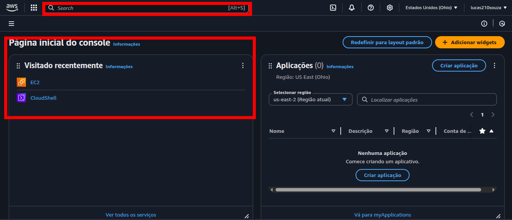

3. Clicar em instâncias(em execução)

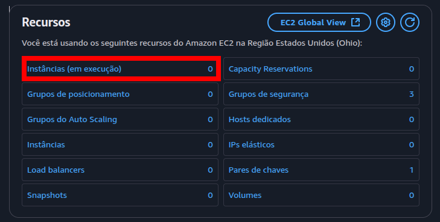

4. Clique em no botão 'Executar instância'

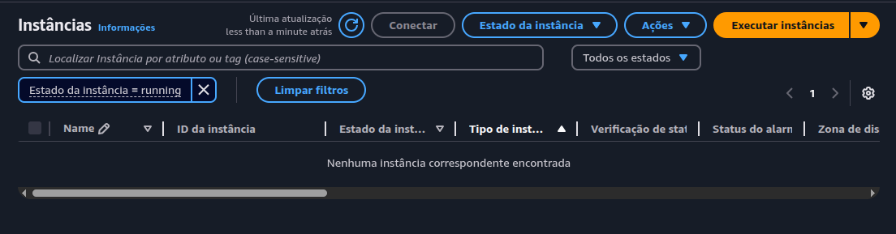

5. Digite um nome no campos:

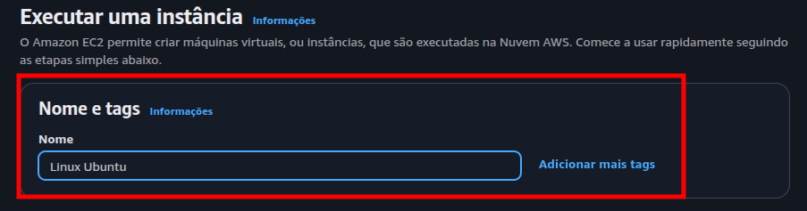

6. Escolha uma distribuição

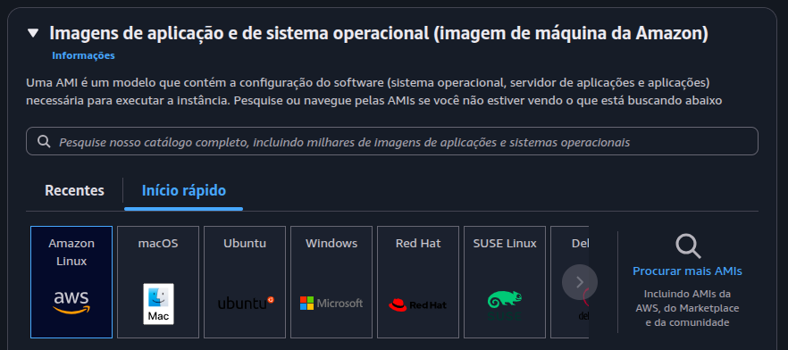

7. Escolha a imagem da máquina que você deseja atuar

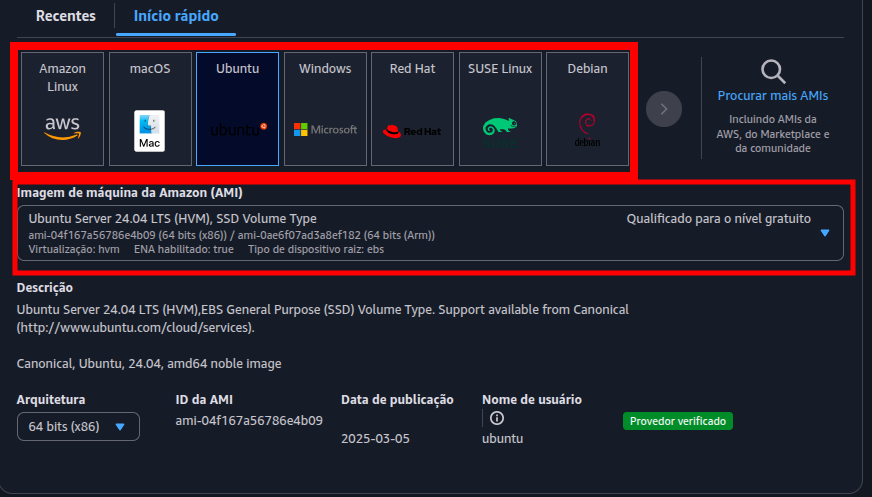

8. Escolha um tipo diferente de instância se sua conta não for gratuita, caso contrário não precisa alterar.

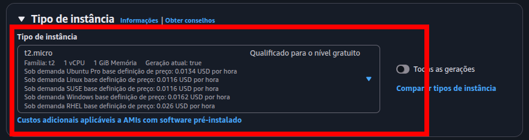

9. Escolha sua chave caso você tenha criado, caso contrário clique em cliar novo par de chave

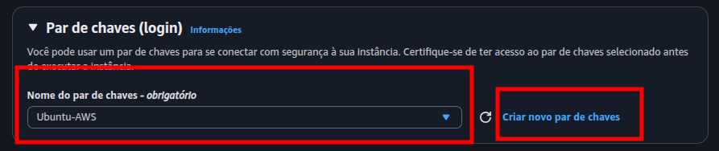

10. criando par de chave, caso não tenha criado anteriormente, dê um nome para seu par de chave.

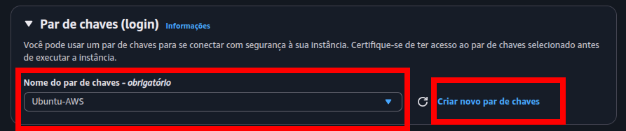

- para linux:

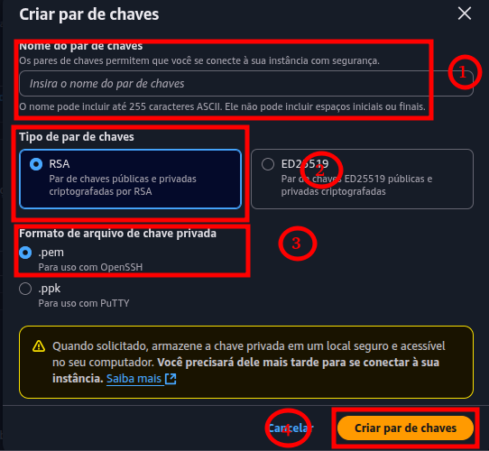

- windows:

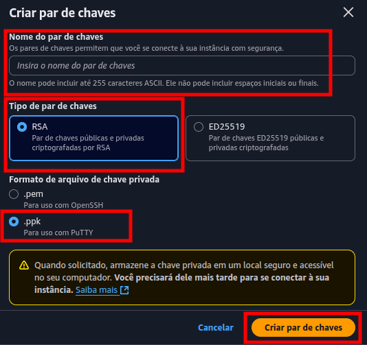

- faça o download e guarde em algum local do seu computador para ser usado para fazer a conecção.

11. Não modifique nada aqui:

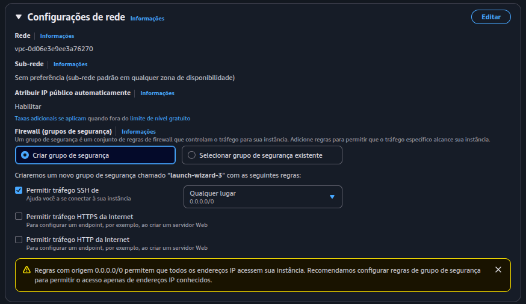

12. Não altere nada aqui

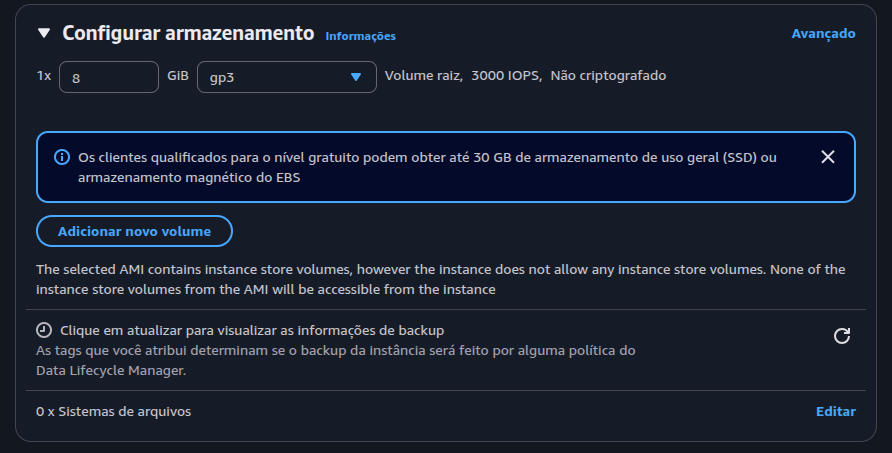

13. clique em execultar instância

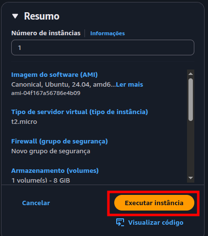

14. Espere concluir

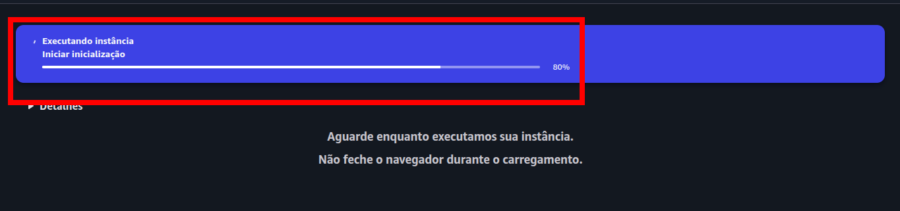

15. Finalizado

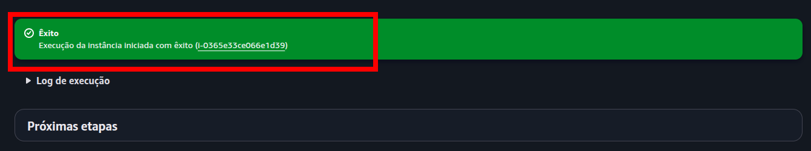

16. Role para baixo e clique em visualizar todas as instâncias

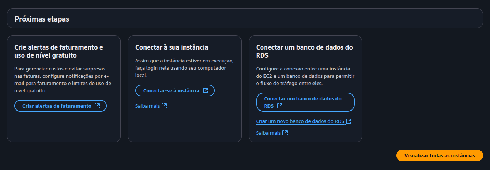

17. Visualizando todas as instâncias em execução

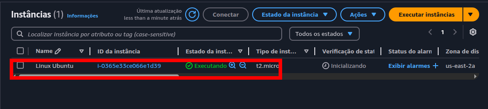

18. Selecione a instância e pegue o valor o enderenço IPV4 público

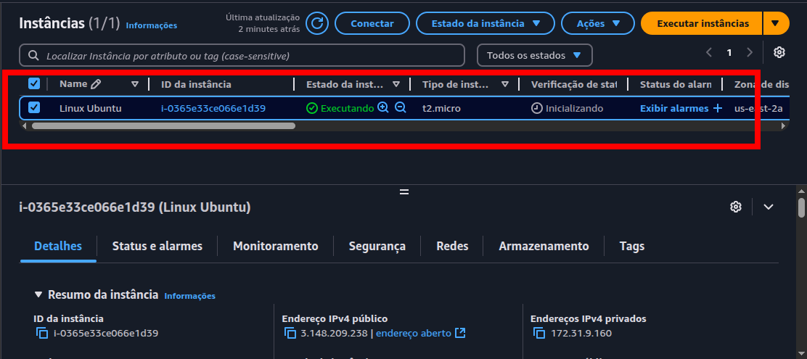

19. Se desloque para o diretório onde você baixou o arquivo das duas chaves

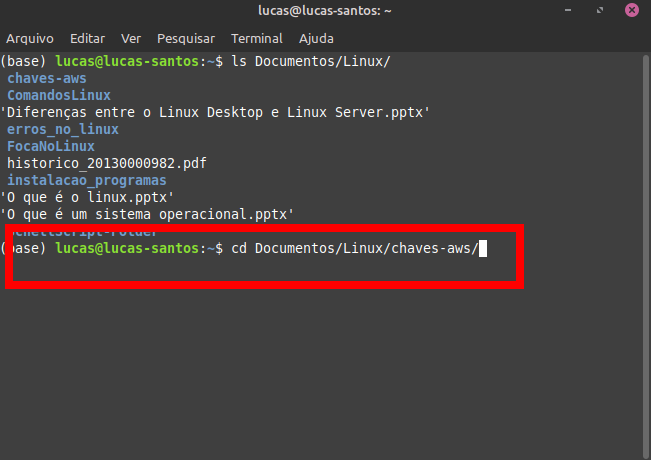

20. modifique as permissões do arquivo das chave publica, usando o comando abaixo:

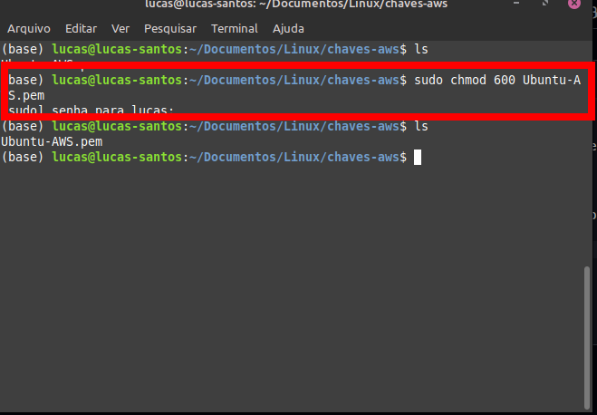

21. E por fim use o comando abaixo para fazer a conecção usando o protocolo SSH, lembrando é preciso ter um cliente ssh para poder fazer a conecção:

- Linux: openssh: sudo apt install openssh-server

`ssh -i Ubuntu-AWS.pem ubuntu@3.148.209.238`

- Windows: baixar e instalar o putty e veja como faz essa conecção em algum video na internet. 

22. Digite o comando acima e dê enter:

- Vai aparecer uma mensagem do tipo: Are you sure you want to continue connecting (yes/no/[fingerprint])? E DIGITE 'yes'.

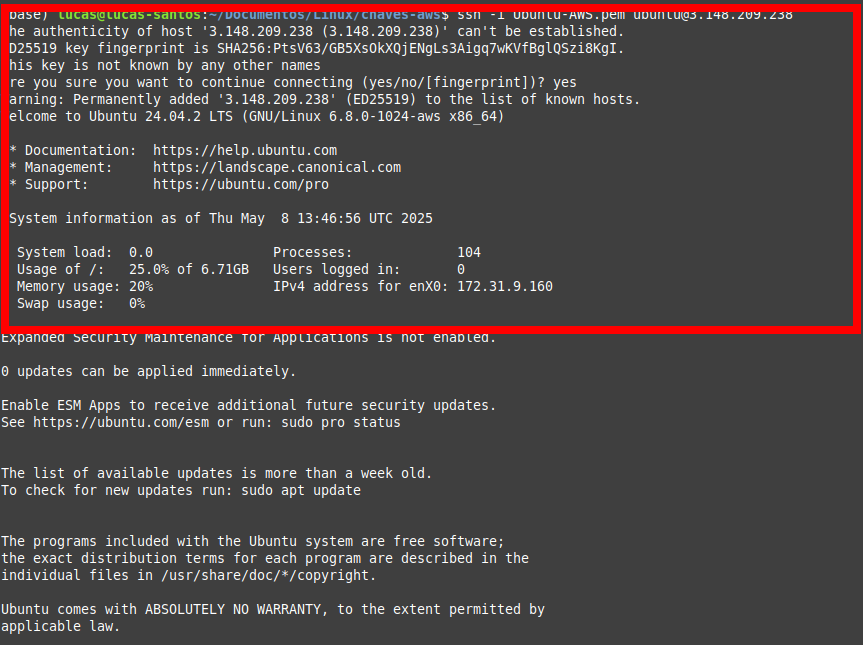

23. Se você fez tudo certo, seu terminal vai ficar assim:

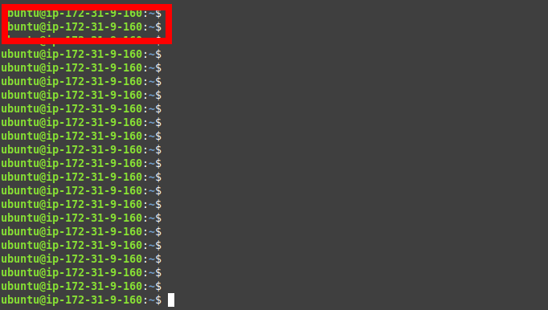

24. Para sair, digite: Ctrl + D
