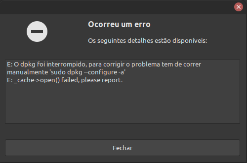

# Erro do dpkg

## Descrição do problema

    Quando vc tenta atualizar alguns pacotes ou verificar se existe alguma atualização pendente,
    no sistema, você pode encontrar esse tipo de erro, visto na figura abaixo:

    Antes de ir para correção, se vc olhar a imagem, o próprio sistema já mostra uma alternativa 
    para ajustar, mas como eu não prestava atenção nas mensagens, quebrei muito a cabeça em algo 
    que era simples. Então, antes de sair pesquisando, verifique se o próprio linux não te dar 
    uma solução para o problema, caso não dê, então é melhor ir procurar.

    Esse erro pode acontecer devido algum processo na instalação. Isso já aconteceu comigo em 
    algumas situaçoes:

    1. Meu PC derrepente travou e ao reenicia-lo percebi que não estava conseguindo atualizar 
    ou instalar outro programa;
    2. Parei sem querer uma instalação;
    3. Do nada, não sei o que fiz ou se foi um bug do sistema, provavelmente fui eu, deu esse erro.

    Para resolver esse problema eu fui ao sites sobre e decobrir o que era o problema e como 
    resolver, depois de muita tentativa erro.

## Solução

    Umas das grandes vantagens dos sistemas linux é que são grátis e mesmo que vc ferre com a 
    distribuição, que vc está usando, vc pode baixa-lá novamente e instala-lá novamente. Mas 
    ninguém tem a paciência de Jó para ter que instalar todos os programas novamente e preferem
    ir ao um "especialista" ou formatando seu PC; mas uma das grandes vantagens, das longas pesquisa,
    tentando consertar sua máquina, é que no percurro vc acaba aprendendo muito, e isso te deixa mais 
    independente dos pseudos especialistas que cobram o olho da cara para consertar, um simples erro, 
    claro que tem pessoas sérias, mas a falta de conhecimento pode custar caro demais. No entanto, 
    depois dessa inrolação toda acima, a maneira que encontrei foi digitar dentro do terminal:

### Comando

    **sudo dpkg --configure -a**
